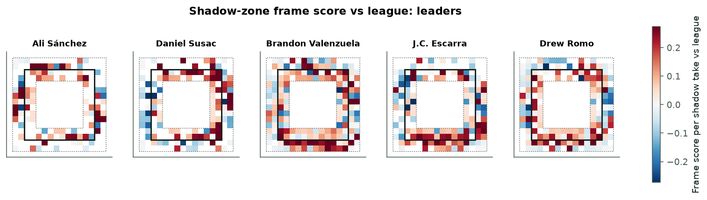
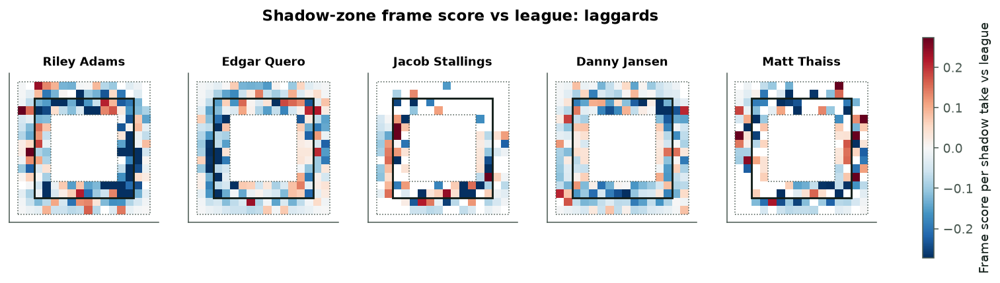
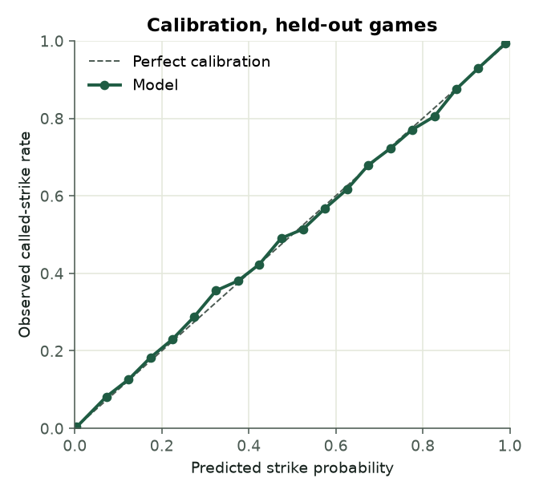
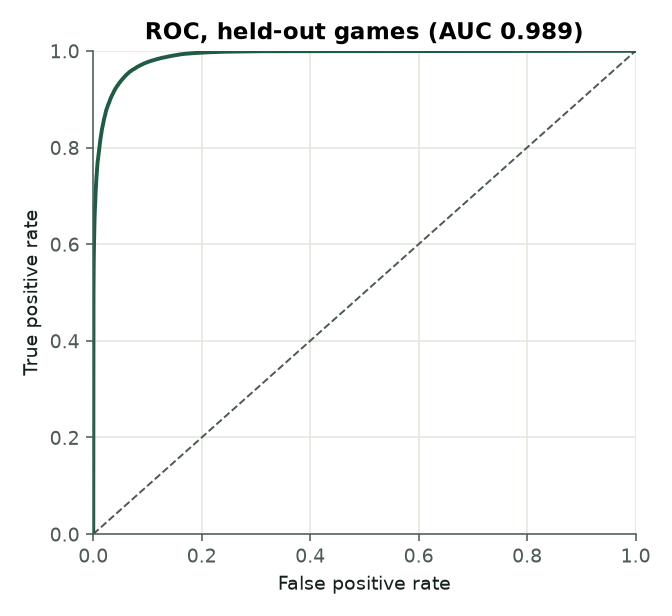
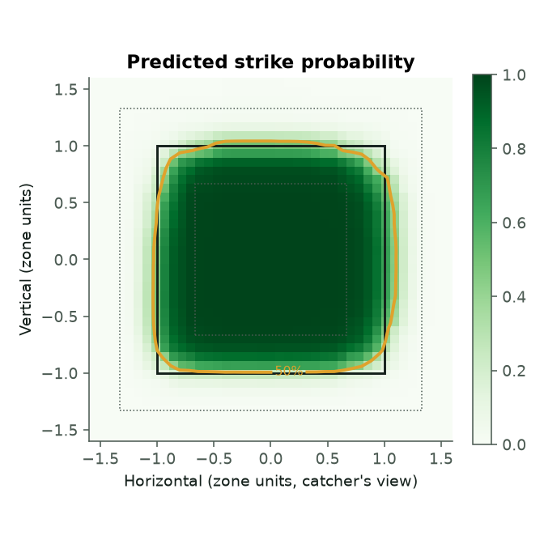
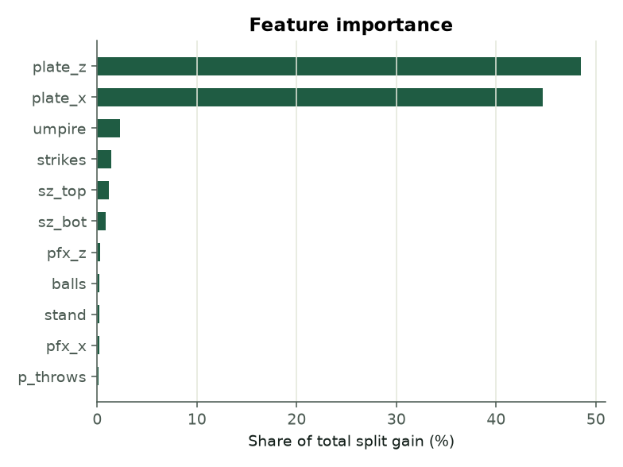
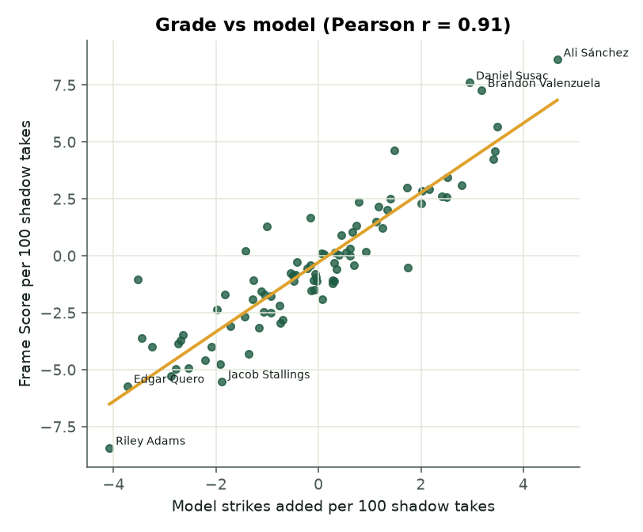
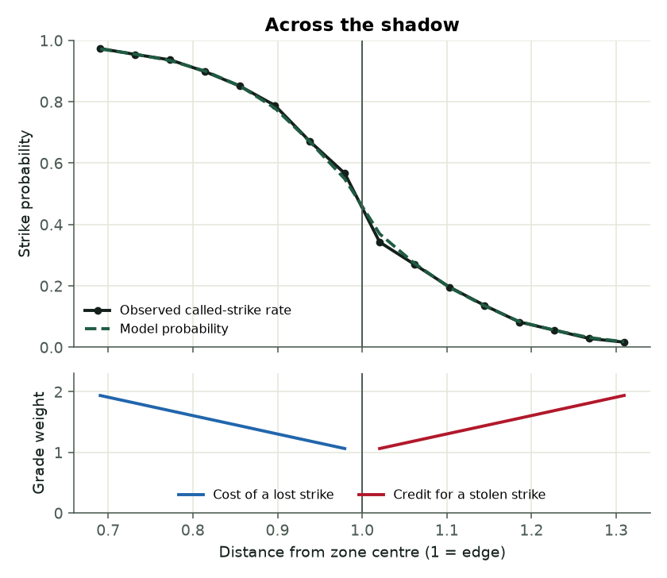
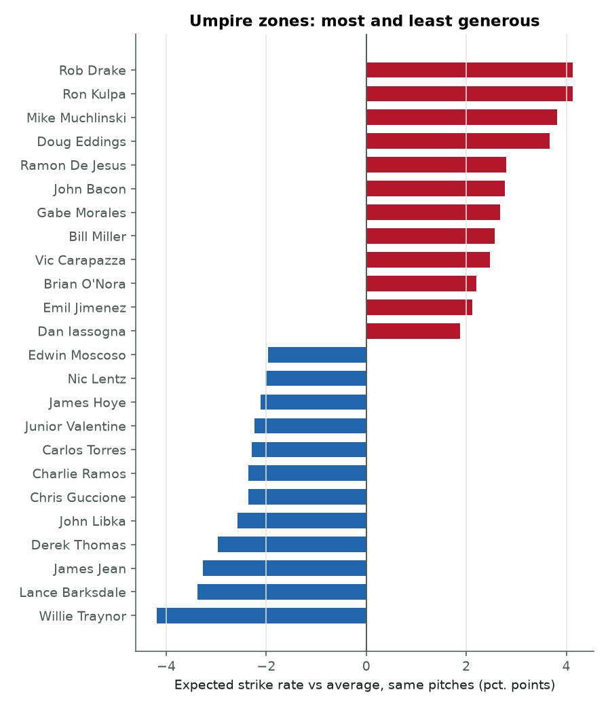
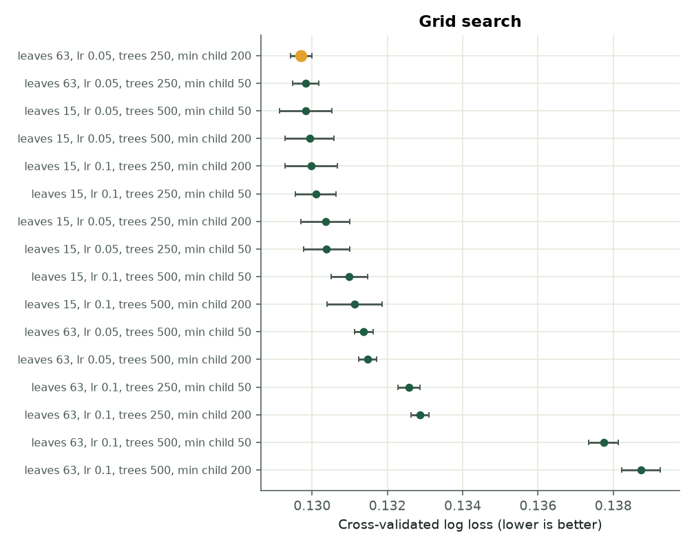

# Catcher Framing

[](https://github.com/treychase/Catcher-Framing/actions/workflows/ci.yml)
[](https://github.com/treychase/Catcher-Framing/actions/workflows/pipeline.yml)

A predicted called-strike model and a shadow-zone catcher framing grade, built
on every 2025 and 2026 regular-season take in Statcast.

**Live page:** <https://treychase.github.io/projects/catcher-framing.html>

<!-- RESULTS:START -->
## Results, 2025-2026 (built 2026-09-28)

740,166 called pitches in 4,859 games, 2025-03-18 to 2026-09-27; 95 umpires, 278,977 shadow takes graded.

**Model, held-out games:** AUC 0.989, log loss 0.1242, Brier 0.0378, accuracy 94.8%. Shadow takes only: AUC 0.939. Without the umpire feature, log loss rises to 0.1252. Best grid point: num_leaves 63, learning_rate 0.05, n_estimators 250, min_child_samples 200.

**Validation:** Frame Score vs model strikes added, r = 0.91 (Spearman 0.90) across 87 qualified catchers; 8 of 10 top framers in common. Stolen strikes carried a 37.3% model strike probability against 14.4% for all out-of-zone shadow takes. Year to year: r = 0.28 for Frame Score, 0.43 for model strikes added (n = 61).

### Best framers
| Rk | Catcher | Grade | FS/100 | Stolen | Lost | Shadow takes | Model SA/100 | Framing runs |
|---|---|---|---|---|---|---|---|---|
| 1 | Ali Sánchez | 80 | +8.6 | 122 | 54 | 1,027 | +4.7 | +6.2 |
| 2 | Daniel Susac | 76 | +7.6 | 106 | 41 | 1,182 | +3.0 | +4.6 |
| 3 | Brandon Valenzuela | 75 | +7.3 | 207 | 103 | 1,887 | +3.2 | +8.1 |
| 4 | J.C. Escarra | 70 | +5.7 | 135 | 76 | 1,366 | +3.5 | +6.4 |
| 5 | Drew Romo | 67 | +4.6 | 135 | 79 | 1,560 | +1.5 | +3.2 |
| 6 | Patrick Bailey | 66 | +4.6 | 597 | 400 | 6,069 | +3.4 | +26.8 |
| 7 | Alejandro Kirk | 65 | +4.3 | 509 | 342 | 5,127 | +3.4 | +22.8 |
| 8 | Tyler Heineman | 63 | +3.4 | 266 | 184 | 2,904 | +2.5 | +9.8 |
| 9 | Luke Maile | 62 | +3.1 | 81 | 61 | 851 | +2.8 | +3.8 |
| 10 | Luis Torrens | 61 | +3.0 | 403 | 315 | 4,194 | +1.7 | +9.5 |

### Worst framers
| Rk | Catcher | Grade | FS/100 | Stolen | Lost | Shadow takes | Model SA/100 | Framing runs |
|---|---|---|---|---|---|---|---|---|
| 87 | Riley Adams | 24 | -8.4 | 147 | 296 | 2,314 | -4.1 | -12.0 |
| 86 | Edgar Quero | 33 | -5.7 | 179 | 333 | 3,409 | -3.7 | -15.6 |
| 85 | Jacob Stallings | 34 | -5.5 | 76 | 117 | 1,055 | -1.9 | -2.3 |
| 84 | Danny Jansen | 34 | -5.3 | 242 | 398 | 3,931 | -2.9 | -13.5 |
| 83 | Matt Thaiss | 35 | -5.0 | 90 | 140 | 1,286 | -2.8 | -3.8 |
| 82 | Willie MacIver | 35 | -4.9 | 56 | 88 | 824 | -2.5 | -2.7 |
| 81 | Will Smith | 36 | -4.7 | 291 | 462 | 4,517 | -1.9 | -10.2 |
| 80 | Salvador Perez | 37 | -4.6 | 241 | 379 | 3,840 | -2.2 | -11.0 |
| 79 | Martín Maldonado | 37 | -4.3 | 97 | 147 | 1,394 | -1.4 | -2.0 |
| 78 | Mitch Garver | 38 | -4.0 | 121 | 180 | 1,994 | -2.1 | -4.9 |

| | |
|---|---|
|  | |
|  | |
|  |  |
|  |  |
|  |  |
|  |  |
<!-- RESULTS:END -->

## What it does

1. **Data.** Every regular-season pitch from Baseball Savant's CSV search, in
   two-day windows so no request hits Savant's 25,000-row cap, cut down to takes
   the plate umpire had to call (`called_strike`, `ball`, `blocked_ball`;
   pitchouts and intentional balls removed). Statcast's own `umpire` column is
   empty, so the home plate umpire comes from the MLB Stats API schedule
   (`hydrate=officials`, with the boxscore as a fallback) and is joined on
   `game_pk`. Catcher names come from the Stats API people endpoint.
2. **Called-strike model.** LightGBM on plate location (`plate_x`, `plate_z`),
   the batter's zone (`sz_top`, `sz_bot`), movement (`pfx_x`, `pfx_z`), the
   count, handedness, and the **umpire as a native categorical feature**, so
   each umpire gets his own zone shape. The catcher is deliberately not a
   feature: what the model cannot explain about a call is framing.
   Hyperparameters come from `GridSearchCV` over leaves, learning rate, trees
   and minimum child size, scored on log loss with `GroupKFold` by game.
   Diagnostics (AUC, log loss, Brier, calibration, ROC, feature importance, a
   no-umpire ablation) are on a held-out fifth of games. The probabilities used
   for framing are **out-of-fold**, so no pitch is scored by a model that saw
   its game.
3. **Shadow-zone grade.** Locations are converted to zone units: 0 is the
   middle, ±1 is the plate edge widened by a ball's radius, vertically scaled
   to each batter's own zone. The distance from the middle is the larger of the
   two axes, and the **shadow** is 0.67 to 1.33, Savant's attack-zone
   definition. Only shadow takes are graded:

   | Call | Where | Points |
   | --- | --- | --- |
   | Ball called a strike (stolen) | outside the edge, 1.00 to 1.33 | **+1 at the edge rising linearly to +2** at the shadow's outer border |
   | Strike called a ball (lost) | inside the edge, 0.67 to 1.00 | **−1 at the edge falling linearly to −2** at the shadow's inner border |
   | Called correctly | anywhere | 0 |

   Frame Score per 100 is the net per 100 shadow takes. The grade is
   `50 + 10 × z` among qualified catchers, clipped to the 20–80 scouting scale
   (800 shadow takes over both seasons, 450 in one).
4. **Validation against the model.** Pitch level: stolen strikes should carry
   a low model probability, falling further as the weight rises. Catcher level:
   Frame Score per 100 against the model's strikes added per 100 shadow takes
   (Pearson, Spearman, top and bottom ten overlap). Stability: each measure
   from 2025 to 2026. Framing runs are model strikes added × 0.125.
5. **Outputs.** CSVs, `metrics.json` and PNG diagnostics in `results/`, and a
   self-contained page (leaderboards, per-catcher zone heatmaps, validation,
   model diagnostics) in `site/catcher-framing.html`.

## Layout

```
framing/
  config.py      every modelling decision: features, grid, zone geometry, weights
  data.py        Savant + Stats API fetchers, caching, cleaning
  zone.py        normalized zone coordinates and attack zones
  model.py       feature spec, grouped grid search, fit, out-of-fold, diagnostics
  grading.py     shadow-zone pitch scores, catcher table, 20-80 grades, heatmaps
  validate.py    grade vs model, pitch and catcher level, year to year
  plots.py       static PNG diagnostics
  report.py      writes the payload into templates/catcher_framing_template.html
  synthetic.py   Statcast-shaped synthetic data for tests and dry runs
  cli.py         python -m framing {fetch,run}
tests/           pytest suite (runs offline on synthetic data)
results/         the latest build's numbers and figures
site/            the latest build's page
```

## Running it

```bash
pip install -e ".[dev]"
python -m framing fetch            # pull and cache Statcast + umpires under data/
python -m framing run              # model, grade, validate, write results/ and site/
python -m framing run --synthetic --quick   # offline dry run on generated data
pytest                             # unit tests
```

## CI/CD

* **CI** (`.github/workflows/ci.yml`) runs on every push and pull request:
  `ruff` lint and format checks, the pytest suite with coverage on Python 3.10
  and 3.12, and a synthetic end-to-end build whose page is uploaded as an
  artifact.
* **Pipeline** (`.github/workflows/pipeline.yml`) runs on a weekly schedule,
  on demand, and whenever the model code changes. It gates on the tests,
  restores the cached Statcast pulls, fetches only new days, rebuilds the
  model, grades and page, uploads them as an artifact, and commits `results/`
  and `site/` back to the branch. On `main` it also publishes the page to
  `treychase.github.io/projects/catcher-framing.html` when a
  `SITE_DEPLOY_TOKEN` secret (a fine-grained token on the site repository with
  *Contents: read and write*) is present; without it that step is skipped.
